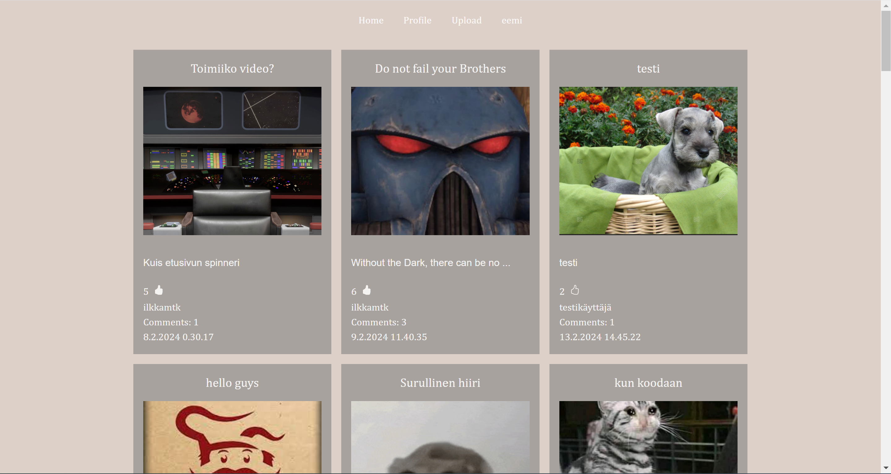

# Hybridisovellukset kurssin projekti

Tästä [linkistä](https://users.metropolia.fi/~eemiko/Media-Application) pääsette käymään sivulla

---

# Tietoa Projektista

 Tässä testikäyttäjä, jolla voi testata toimintoja.

 - **Käyttäjätunnus**: Testimies
 - **Salasana**: TestiSalasana1

 (Huom! Sinun pitää olla Metropolian verkossa tai käyttää VPN-yhteyttä, jotta näet sivun sisällön.)

## Käytetyt Teknologiat

- **React.js**
- **Tailwind CSS**
- **MySQL**

## Backend

Backend on toteutettu opettajan valmiiksi tehtyjen palvelimien avulla, jotka kattavat:
- **Upload**
- **Auth**
- **Media_API**
- **GraphQL_API**

## Toiminnallisuudet

Kaikki alla mainitut toiminnallisuudet toimivat moitteettomasti.

- **Kirjautuminen/Rekisteröityminen**
- **Julkaiseminen**
- **Tykkääminen**
- **Kommentointi**
- **Oman julkaisun poistaminen**
